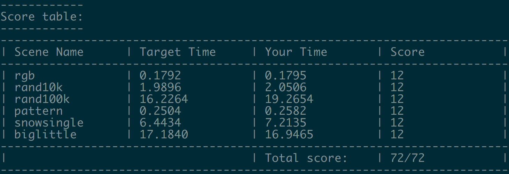

# 15-618 Assignment 2

-----

#### Score Table

##### Prob 1

#### Compare and explain the difference between the results provided by two sets of timers (the timer you added and the timer that was already in the provided starter code).

It is can be seen from the picture above that kernel running time accounts for a very small proportion of the overall time. We think it is because data transferring time between GPU and CPU is much slower than the kernel running time.

#### Are the bandwidth values observed roughly consistent with the reported bandwidths available to the different components of the machine?

No. The observed bandwidths of RTX 2080 GPU( approximately 9.3GB/s) is lower than the reported bandwidths 448GB/s.

##### Prob 2

##### Prob 3

#### Describe how you decomposed the problem and how you assigned work to CUDA thread blocks and threads (and maybe even warps.)

We divide the whole image evenly into many $32\times 32$ (pixel^2) square areas. 

Each `CUDA block`, `blockDim = dim3{32,32}` , handles such an area and each thread in the block handles one circle and or one pixel respectively in different kernel computing stage. It is the most tricky part of our design that we can use linearThreadId as both circleId or pixelId in one block and the CUDA block size is exactly the same as physical image square area after division . We use `gridDim=dim3{36,36}` blocks to solve the whole picture together.

In each kernel block, we need to do three main tasks: 1. determine which circles are intersected with the block's corresponding physical square areas using `circleInBox` function in `circleBoxTest.cu_inl` file; 2. organize the result of step 1. into circleId's indices array for the block using `sharedMemExclusiveScan` function in `exclusiveScan.cu_inl` file; 3. use the array obtained from step 2. to render all the pixels in the block. We use for loop and handle 1024(blocksize) circles and 1024(blocksize) pixels' rendering in each iteration. All the arrays used in these three steps only reside in each block's shared memory. This design greatly increase our performance from 24/72 to 60/72.
#### What,if any,steps did you take to reduce communication requirements(e.g.,synchronization or main memory bandwidth requirements)?
Where are the last 12 points come from? After analyzing the rendering process, we find that we update `*imgPtr` in every 1024 pixels of each iteration. But `imgPtr` is a global memory address. Then we declare a local thread variable to store the intermediate results of pixels' rendering and update the global memory's content before exiting of kernel call. Then our performance goes from 60/72 to 72/72. Of course, the utilization of block shared memory in exclusive_scan, etc steps reduce communication requirements. It transforms all threads across blocks to each block's internal synchronization and only threads in the same block need to communicate.  

#### Describe where synchronization occurs in your solution.

Every time we need to use `sharedMemExclusiveScan()`, we need  `__syncthreads()` to make sure all the input data are ready because the input data is constructed by many threads' `circleInBox` calls.

Every time we got the `pre-sum` array and need to calculate the circle dependency sequence related to one area using `pre-sum` array and one-hot encoded circle sequence, we need `__syncthreads()` to make sure every item in the `pre-sum` array are ready, as the `pre-sum` array is constructed by many threads.

After that, we need another `__syncthreads()` because the circle dependency sequence is constructed by many threads. Then we can render a batch of circles.

After we rendered this batch of threads, we need another `__syncthreads()` to make sure every thread finishing rendering the same batch of circles indexed by the same increasing orders which ensures the "order" invariant. The "atomicity" invariant is guaranteed because each kernel thread only renders a fixed physical pixel in image and there is no disturbance between threads.

#### Briefly describe how you arrived at your final solution. What other approaches did you try along the way. What was wrong with them?

We tried two different methods. 

At first, we make each thread handle one pixel. Each thread will try all the circles. This is unnecessary, because there are only a very small part of circles that contribute to one  pixel. Looping over all the pixels is time-consuming.

Then we tried looping over all circles to have the one-hot encoded sequence of circles that contribute to each individual pixel, which will then be handled by `thrust::exclusive_scan` to generate the dependency list for each pixel. This method is not efficient either, as all the data are stored in the global memory which brings about too much synchronization and communication costs. The performance of this implementation sucks and is even worse our first attempt--the simplest parallelism of pixels. Afterwards, we find that the pixels and circles are spatially-contiguous, we only need to calculate the related circles in a group of contiguous pixels and must utilize the block shared memory to reduce memory access costs and communication among threads.